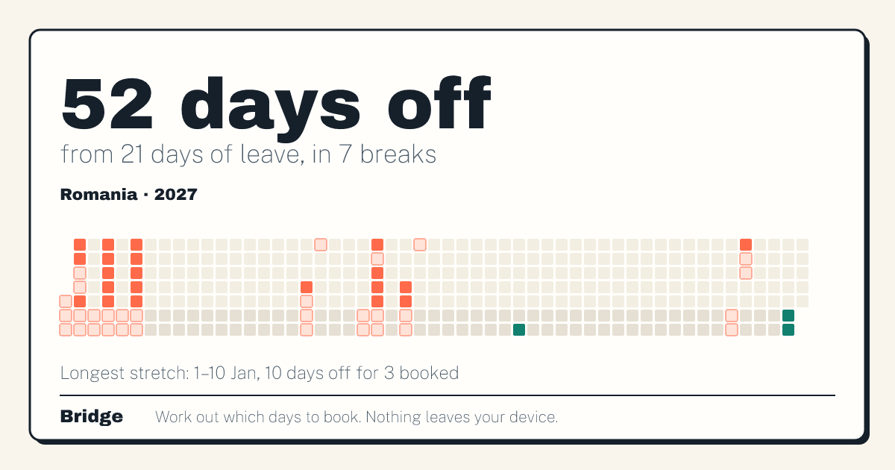

# Bridge

**Take 12 days off. Get 28.**

Pick your country and how many days of annual leave you have. Bridge works out which
specific days to book so your leave joins up with weekends and public holidays into
the longest possible stretches of continuous time off. It shows the year as a
calendar, lists the exact dates to request, and exports them to your calendar.

Romania, 21 days, 2026: **21 leave days become 54 days off, across 6 breaks.** Four
days booked in early June buys nine days off, because Whit Monday and Children's Day
both land on the 1st. Six days in December buys eleven.



## Why it works this way

- **No backend.** Static files. No API calls at runtime, no serverless functions, no
  database.
- **No network requests after load.** No analytics, no font CDN, no telemetry.
  Holiday dates are bundled at build time and everything is served from one origin.
  The app counts its own requests and shows you the number.
- **No accounts, no email, no cookies.** The plan lives in the URL hash, which is why
  a link reproduces it exactly and why nothing needs storing. One opt-in checkbox may
  remember your country and allowance in `localStorage`, and nothing else.
- **Works offline.** A service worker caches the app shell. Turn off your wifi and
  reload.

Leave plans are personal before they are approved. But mostly: this needs nothing
from a server, so asking you to make an account for it would be absurd.

## How the solver works

`src/solver/` is a pure module with no DOM and no React. It is **exactly optimal**,
not a heuristic and not greedy, because the whole credibility of the app is that the
answer is the best one available and the problem is small enough to solve properly.

**Classify every day.** Free (a weekend, or a public holiday on a working day),
a working day, blacked out (you cannot take it), or pinned (you have fixed it).

**Enumerate candidate breaks.** A window is a run of days that would all be off. Its
value is its whole length, weekends and holidays included, because that is what a
break feels like. Its cost is only the working days inside it. Two rules prune the
set: a window must be *maximal*, meaning the days either side of it stay worked, and
it must cost at least one day of leave or cover a pinned day. For a year with a
40-day allowance that leaves about 9,000 candidates.

**Solve by dynamic programming.** `dp[d][b][k]` is the best total achievable using
days up to `d`, spending at most `b` days of leave, in at most `k` breaks. A window
ending at `d` reads back from `dp[start - 2]`, which forces at least one worked day
between breaks: two adjacent breaks would just be one longer break. Pinned days
cannot be skipped, so every plan covers them.

**Reconstruct** the chosen windows and the exact dates.

Because the table is built for every budget from zero upwards, the
diminishing-returns curve comes free. The app shows what each individual day of
leave buys you, which is genuinely useful and which nobody else shows.

Solving a full year with 40 days of leave takes about 5ms, so tapping a day to pin
or rule it out re-plans instantly.

### The three objectives

| Objective | What it does |
|---|---|
| Several proper breaks | Default. Real holidays rather than a string of long weekends. |
| One long trip | Puts most of the allowance into a single stretch, then spends the rest. |
| Most days off, any length | The highest possible total, mostly by turning Fridays into long weekends. |

The default is **several proper breaks**, with a floor of five days. Maximising the
raw total is exactly solvable and provably optimal, but the way to maximise it is to
book isolated Fridays: one day of leave buys a three-day weekend, a ratio of 3.0,
which beats every holiday bridge. For Romania 2026 it returns 74 days off across 21
breaks, fourteen of them indistinguishable long weekends. That is the right answer to
the question and the wrong answer for someone planning a year, so it is offered but
not the default.

### Tests

```bash
npm test
```

72 tests. The one that matters is `bruteforce.test.js`, which generates roughly a
thousand random calendars and checks the solver against exhaustive search over every
possible combination of days. It covers blackouts, pinned days, break caps, minimum
lengths, four-day weeks and Tuesday-to-Saturday weeks. If a non-maximal window were
ever optimal, or the pruning were unsound, these would fail.

`countries.test.js` checks real calendars: Orthodox Easter moving between 2026 and
2027, British substitute bank holidays, American observed days, and two German
Länder that genuinely differ. `plainDate.test.js` checks every date function against
`@js-temporal/polyfill`, day by day across fifteen years.

## Holiday data

Dates come from [`date-holidays`](https://github.com/commenthol/date-holidays), run
**at build time only**. It is roughly a megabyte of rules and never reaches the
browser. `scripts/build-holidays.mjs` emits one JSON file per country covering the
current year and the next two, and the output is committed so builds are
reproducible and a human can diff what changed on an upgrade.

```bash
npm run holidays
```

Each file records the ISO date, the local name, the English name, the type, whether
it is a substitute day, which regions observe it, the library version and a
timestamp. Only public and bank holidays ship in the main layer; observances go in a
separate one that is off by default.

Countries: Romania, United Kingdom, Germany, France, Spain, Italy, Netherlands,
Poland, United States, Canada, Australia. Subdivisions are supported where holidays
genuinely differ. Each country's file is loaded on demand and is under 4KB gzipped.

### Known problems with the data

- **Romania announces extra bridge days ad hoc.** The government declares *punți*
  around some holidays by decision, sometimes only weeks ahead. Those cannot be
  predicted and are not in here.
- **The library's UK-wide list is wrong.** It omits the late-August bank holiday that
  England, Wales and Northern Ireland all observe. Bridge therefore always uses a
  nation rather than a UK-wide list, with England preselected.
- **German Christmas Eve and New Year's Eve** are marked as bank holidays but are not
  statutory public holidays in any Bundesland. Some employers give them, some give a
  half day, some give neither.
- **Holidays on lunar or non-Gregorian calendars** are approximations in any dataset.
- Regional and sector holidays vary, and some employers do not observe all of them.

Report a wrong date as an issue rather than assuming the plan is right.

## Running it locally

```bash
npm install
npm run dev
```

The dev server runs on **http://localhost:8765**.

| Command | What it does |
|---|---|
| `npm run dev` | Dev server on port 8765 |
| `npm test` | The solver test suite |
| `npm run build` | Static `dist/`, deployable anywhere |
| `npm run preview` | Serve the production build |
| `npm run holidays` | Regenerate the committed holiday JSON |
| `npm run og` | Regenerate the social preview image |
| `npm run report` | Print a plan on the terminal, e.g. `npm run report -- RO 2026 21` |

`npm run report` is useful for checking an answer against a real calendar without
opening a browser.

## Deploying

`npm run build` produces a static `dist/` that Cloudflare Pages serves with no
configuration. `public/_redirects` handles the SPA fallback and `public/_headers`
sets a content security policy restricting everything to this origin, which is what
makes the zero-request claim enforceable rather than merely true.

Build command `npm run build`, output directory `dist`.

## Stack

React 18 and Vite, plain JavaScript with JSDoc types where the solver gets dense.
Tailwind CSS v4 for styling, with the design tokens as plain CSS custom
properties. No router and no state library: the URL hash is the state.

Type is Archivo Black for headings and Public Sans for everything else, both
self-hosted as woff2 with the Latin-Extended subsets behind a `unicode-range`, so
those files are only fetched when a page actually shows Romanian or Polish
letters.

Initial load is about 76KB gzipped, in five requests, none of them to anywhere
else.

### Look

Flat, outlined and loud: a sand ground, deep sea-ink outlines, hard offset shadows
with no blur, and tight corners. Colour carries meaning rather than decoration.
Coral marks the days you book, sea green the public holidays you already had, sky
blue the days you fix yourself, and one warm yellow carries every action.

No day state in the calendar depends on colour alone. Each one also has a shape
under the number: a filled dot for a day you book, a ring for a public holiday, a
diamond for a day you pinned, and diagonal stripes with a struck-through number for
a day you ruled out.

Light and dark both follow the system, with a manual override. Every text pair
clears 4.5:1 and every outline clears 3:1 in both themes.

### A note on dates

The solver deals only in calendar days. "The 4th of June" means the same thing to
everyone, so nothing here may ever touch a timezone or an instant, and there is no
`Date` anywhere in `src/solver/`.

The natural way to guarantee that is `Temporal.PlainDate`, but the polyfill costs
46KB gzipped, about what React itself costs, to provide day addition and
day-of-week. `src/solver/plainDate.js` does the same job in about 0.4KB using the
standard days-from-civil algorithm, and `plainDate.test.js` holds it to account
against the polyfill across fifteen years, including a check that the answers do not
move when the machine's timezone does. Temporal is a development dependency, kept
precisely so that test can run.

## Licence

MIT. See [LICENSE](LICENSE).

Holiday data from [`date-holidays`](https://github.com/commenthol/date-holidays),
also MIT.
